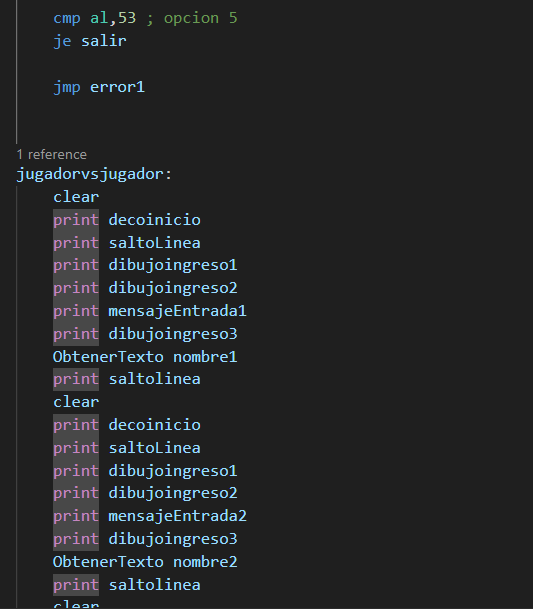
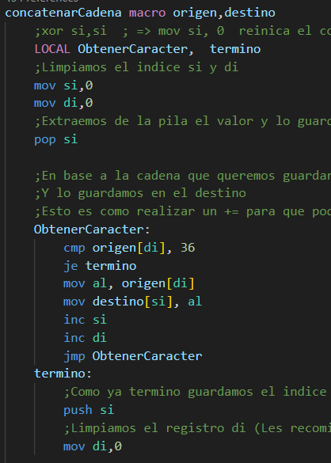

# Manual Técnico

## Introducción

En este manual, encontrarás una descripción completa sobre el codigo utilizado en el programa y la logica utilizada, asi como requisitos de  software.

## Requisitos del Sistema

En este proyecto se utilizo el lenguaje assembler, un lenguaje de bajo nivel. por lo tanto para poder ejecutar el sistema es necesario utilizar:
  
 - MASM611
 - DosBox
 - VsCode (como ide para visualizar el codigo en dado caso sea requerido)

## Estuctura del programa

-   **Segmento de pila**: Inicializa la pila
 

-   **Segmento de datos**: Inicializa el segmento de datos, se agregaron todas las variables que se usaron en el juego y sus respectivos tamaños y valores incialies.

- **Segmento de codigo**: Se inicializo el segmento de codigo y se creo el procedimeito main, se crearon distintas etiquetas en el programa para  ir  estructurando el flujo del programa.

## Macros usadas

- **print**: imprime el valor de una variable que se encuentra definida en el segmento de datos y lo imprime en consola.
- **close**: se encarga de terminar la ejecucion del programa.
- **getChar**: obtiene un caracter que haya sido ingresado.

- **ObtenerTexto**: Obtiene una cadena de caracteres que haya sido ingresado. se detendra al encontrar un salto de linea.

- **clear**: Limpia la pantalla/consola, para hacer esto lo que se hace es escribir varios saltos de linea de forma consecutiva.

- **concatenarCadena**: este se encarga de concatenar dos variables con dos cadenas distintas.

- **delay**: hace que el programa se detenga por un periodo de tiempo.

- **generarrandom**: este codigo genera un numero random de 0 a 6 y luego busca este indice dentro de una cadena de texto  y tomara el caracter en ese indice.

- **Obtenernombre**: de manera similar al de obtener texto obtiene una cadena de caracteres y se detendra hasta encontrar un salto de linea, pero tambien se detendra si se encuentra un " . " en este ultimo caso se enviara un mensaje de error.

- **limpiar** este limpia una variable que tenga un espacio grande asignado.
- **cerrar**: esta macro cerraria el archivo.
- **abrir**: con esto se abre un archivo.
- **escribir**: esta macro nos ayuda a escribir un texto en un archivo existente,
- **crear**: aqui se crea un archivo en blanco con el nombre especificado.

- **leer**: con esto se lee un archivo y se concatena cada uno de sus caracteres en una variable que se usa dentro del main.

- **imprimirceldas**: esta funcion se encarga de imprimir las celdas del tablero con los espacios y simbolos de los bordes que le corresponden.
- **verificar_ganador**: esta macro compara si las 4 celdas consecutivas enviadas son iguales al simbolo del jugador 1 o del jugador dos.
- **columnavacia**: aqui se comprueba si cada celda de la columna esta vacia, si lo esta escribe alli el simbolo del jugador, si no lo esta revisa la siguiente y si ninguna celda esta vacia se envia al mensaje de error.

