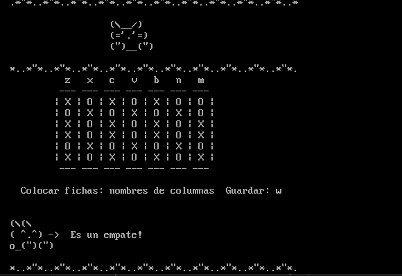
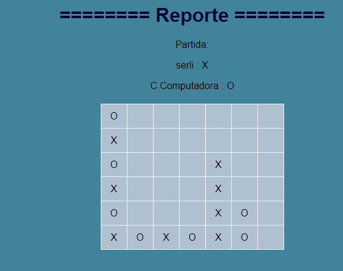

# Manual de Usuario

## Introducción

Este manual está diseñado para  proporcionar todas las herramientas  necesarias para utilizar esta version del juego **Connect 4** .

En estas páginas, encontrarás información detallada sobre las diferentes opciones disponibles en la interfaz y las instrucciones de como jugarlo.

## Información

Al ejecutar el programa por primera vez se podrá tener información a detalle, la que se muestra a continuación:
para poder entrar al menu principal se debe precionar enter en caso contrario aparecera un error como el siguiente:

## Menu principal
Este programa cuenta con un total de 5 funciones:
-   **Jugador Vs Jugador**: Esta opción permite entrar a la modalidad de jugar con dos personas, las cuales haran sus movimientos por turnos. Más adelante se explicara mas a detalle como funciona esta modalidad.
-   **Jugador Vs Computadora**: Esta modalidad en el juego permite juagar contra la computadora.
-   **Cargar partida**: Esta opcion permite cargar los datos de una partida anterior e iniciar la partida desde donde se dejo al momento de guardarla.
-   **Ayuda**: Como su nombre lo indica esta opcion permitira ver información de ayuda sobre el juego.
- **Salir**: Esta opción cerrara el programa, finalizando el juego.

En caso de no presionar una opcion que este del menu se generara un error:

## Jugador Vs jugador

Esta modalidad del juego permite a dos juagadores, al inicio se pide el nombre de los jugadores y posteriormente se podra visualizar el area del tablero en el que se puede jugar.

En la seccion del tablero se deben de considerar 4 aspectos importantes. El encabezado o nombre de las columnas que aparece primero, el tablero, las instucciones  y luego el turno.

En la parte inferior siempre aparecera un mensaje que contendra el nombre del jugador en turno y la ficha que se le asigno, el juego se mantendra asi en espera de que el jugador ingrese  ya sea una opcion para ingresar una ficha o que presione la tecla w que permite guardar el estado de la partida actual.

###  1. Colocar una ficha:

Para colocar una ficha el jugador en turno debera ingresar por teclado la letra que represente a la columna y la ficha se agregara de forma automatica a la ultima fila disponible de dicha columna. En la parte superior del tablero se encuentran las letras z, x,c,v,b,n y m las cuales representan a las columnas del tablero  estas son las letras que se deben ingresar.

En caso de no ingresar alguna de estas letras o que la columna este llena y no haya espacio para ingresar mas fichas, se considerara como un movimiento invalido y no permitira que el turno cambie hasta que el jugador en turno ingrese la ficha en una posicion valida, para informar esto tambien se visualizara un mensaje de error.

### 2. Guardar partida:
Como se menciono antes, durante toda la partida, independientemente de que jugador este en turno se dispondra de otra opcion, que es la de guardar la partida en el estado actual, para hacer esto se deber a de presionar la tecla w.

al presionar esta tecla se pedira al usuario que ingrese el nombre con el que se guardara el archivo y se inciara la creacion del archivo con los datos del juego, si ocurriese algun error al momento de crear el archivo se notificara por medio de un mensaje de error.

## Jugador Vs Computadora

Esta modalidad es similar a la de jugador contra jugador, pero con unas pequeñas diferencias.

al seleccionar esta modalidad solo se solicitara que un jugador ingrese su nombre y este jugara contra la computadora, al igual que en la otra modalidad el juego sera por turnos, pero esta vez solo se mostrara el nombre del jugador al momento de que sea su turno y cuando es el turno de la computadora no se mostrara esto y simplemente la computadora decidira en que lugar poner su ficha.

otra cosa que es igual es que el jugador puede guardar la partida en cualquier momento de la partida siempre y cuando este en su turno.

## Cargar partida
Esta opcion del menu principal, permite abrir el archivo que continene la informacion de una partida anterior que haya sido guardada y cargar esos datos en el sistema para iniciar la partida desde ese estado.

al presionar esta opcion se pediera el nombre del archivo a abrir  y luego se creara el tablero como se habia dejado.

## Ayuda
Esta opcion permite abrir un archivo que contiene la informacion  de ayuda para el juego y se mostrara dicha informacion en consola.

## Salir
Esta opcion dara fin al juego, cerrara todo y saldra del juego.

## Detalles importantes

En el juego lo que se busca es juntar un total de 4 fichas similares de forma continua, es decir que cada jugador debera buscar la manera de juntar 4 de sus fichas ya sea en forma vertical, horizontal o diagonal.

Cuando esto sucede significa que el jugador que consiguio esto ha ganado y aparecera un menasaje en consola informando esto.

A parte de esot puede suceder que ningun jugador logre juntar las fichas , pero que el tablero este lleno y no se pueda continuar, en este caso se considera un empate y aparecera un mensaje informando esto.

Cualquiera de estas opciones representan el fin de la partida por lo que siempre que se finaliza la partida se generara un reporte html con la informacion de los jugadores y del tablero mostrando  la forma en que se gano.

