# Manual Técnico

## Introducción

En este manual, encontrarás una descripción completa sobre el codigo utilizado en el programa y la logica utilizada, asi como requisitos de  software.

## Requisitos del Sistema

En este proyecto se utilizo el lenguaje assembler, un lenguaje de bajo nivel. por lo tanto para poder ejecutar el sistema es necesario utilizar:
  
 - MASM611
 - DosBox
 - VsCode (como ide para visualizar el codigo en dado caso sea requerido)

## Estuctura del programa

-   **Segmento de pila**: Inicializa la pila
 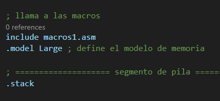

-   **Segmento de datos**: Inicializa el segmento de datos, se agregaron todas las variables que se usaron en el juego y sus respectivos tamaños y valores incialies.

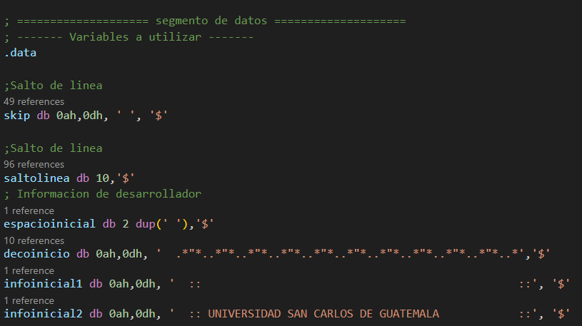
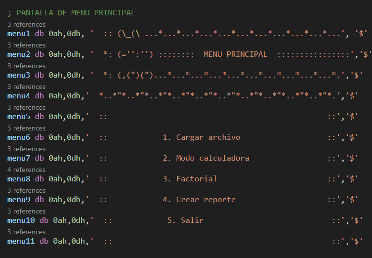

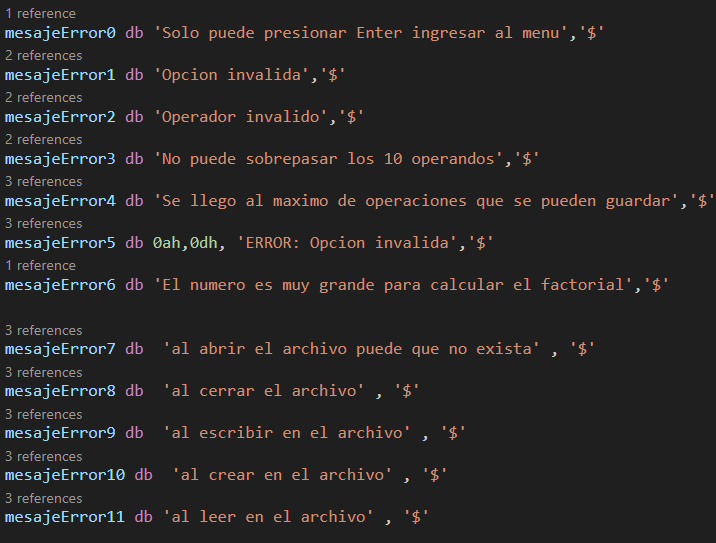
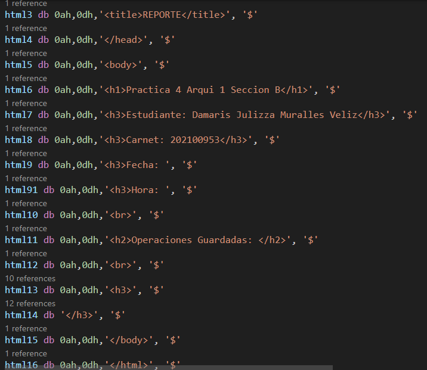

- **Segmento de codigo**: Se inicializo el segmento de codigo y se creo el procedimeito main, se crearon distintas etiquetas en el programa para  ir  estructurando el flujo del programa.
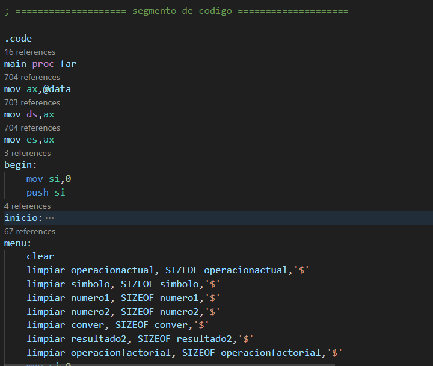
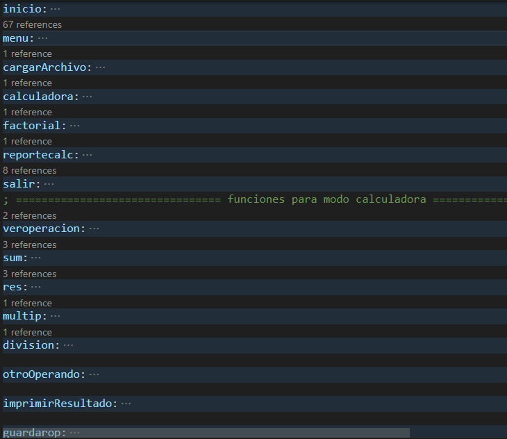
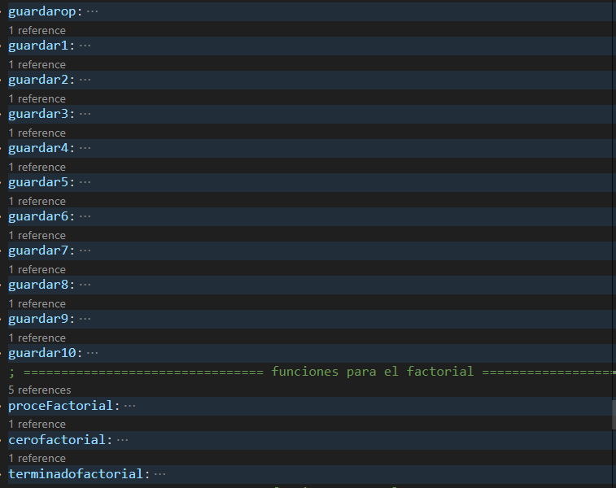
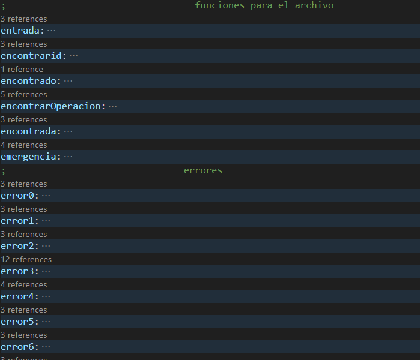
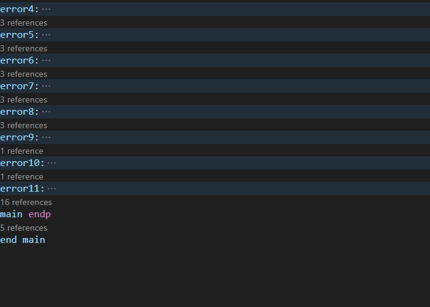
## Macros usadas

- **print**: imprime el valor de una variable que se encuentra definida en el segmento de datos y lo imprime en consola.
- **close**: se encarga de terminar la ejecucion del programa.
- **getChar**: obtiene un caracter que haya sido ingresado.
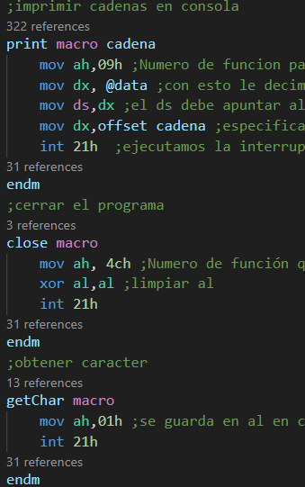
- **ObtenerTexto**: Obtiene una cadena de caracteres que haya sido ingresado. se detendra al encontrar un salto de linea.

- **clear**: Limpia la pantalla/consola, para hacer esto lo que se hace es escribir varios saltos de linea de forma consecutiva.
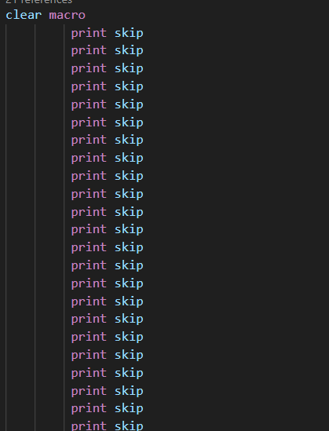
- **concatenarCadena**: este se encarga de concatenar dos variables con dos cadenas distintas.
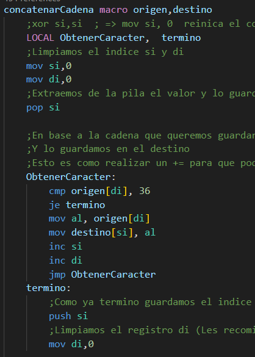
- **delay**: hace que el programa se detenga por un periodo de tiempo.
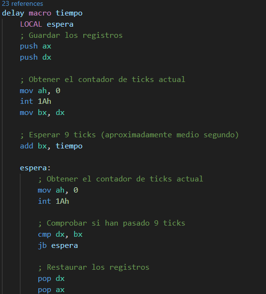

- **limpiar** este limpia una variable que tenga un espacio grande asignado.
- **cerrar**: esta macro cerraria el archivo.
- **abrir**: con esto se abre un archivo.
- **escribir**: esta macro nos ayuda a escribir un texto en un archivo existente,
- **crear**: aqui se crea un archivo en blanco con el nombre especificado.

- **leer**: con esto se lee un archivo y se concatena cada uno de sus caracteres en una variable que se usa dentro del main.
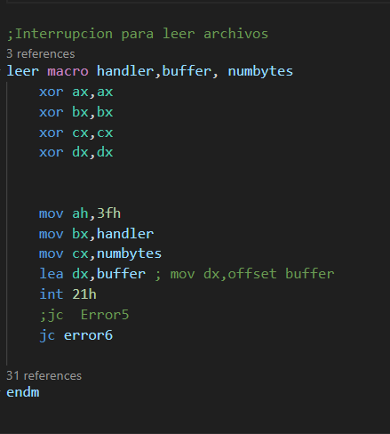

- **sumar**: esta macro nos ayuda a sumar dos numeros.
- **restar**: esta macro nos ayuda a restar dos numeros.
- **multiplicar**: esta macro nos ayuda a multiplicar dos numeros.
- **dividir**: esta macro nos ayuda a dividir dos numeros.

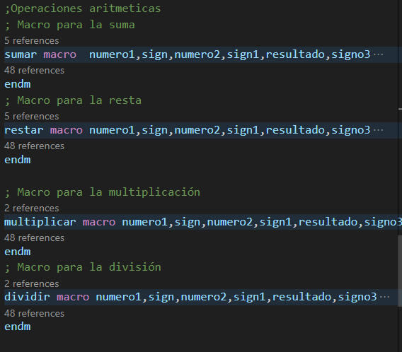
- **imprimirDecimal**: esta macro nos ayuda a convertir un valor en decimal a texto para poder ser impreso en consola.
- **conversor**: esta macro por el contrario nos ayuda a convertir un valor en texto a decimal para poder ser usado en operaciones matematicas.

- **extractorcompleto**: esta macro nos permite obtener cada valor del texto signos, unidades, decenas para poder ser enviados al conversosr y obtener los valores correctos en decimal.

- **ConverString**: esta macro al igual que imprimirDecimal nos ayuda a convertir un valor en decimal a texto para poder ser impreso en consola, pero esta macro nos permite convertir el valor y almacenarlo en una variable para su posterior uso.

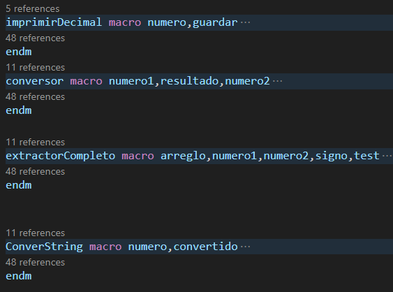
- **factorial**: esta macro nos ayuda a multiplicar un numero por todos los numeros que le anteceden hasta llegar a 1.

- **prefijolect**: esta macro sera la que permitira leer el archivo que contiene las operaciones en notacion prefija y mediante recursion se ira leyendo cada caracter y se ira realizando la operacion correspondiente.
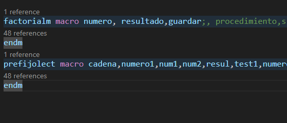

