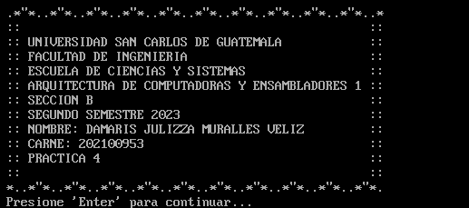
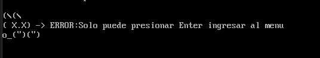
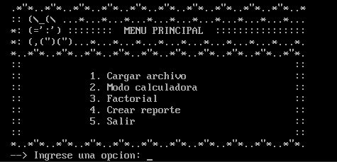
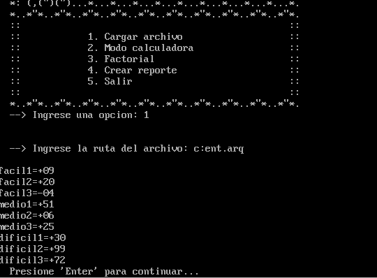
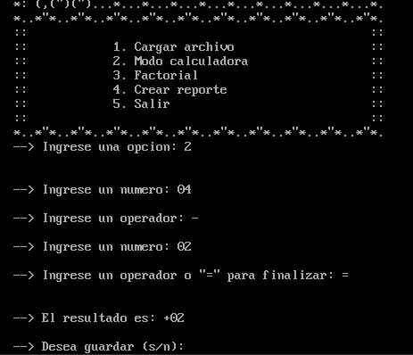
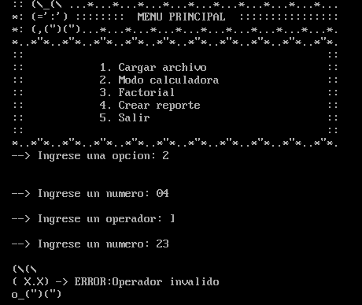
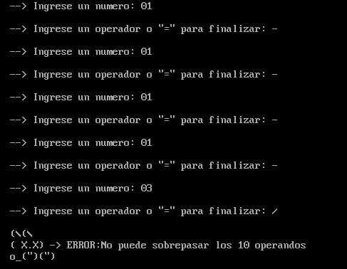
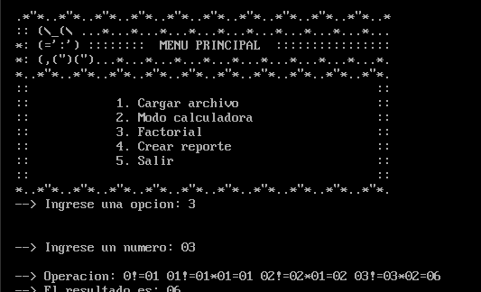
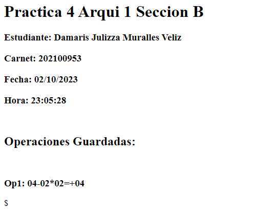
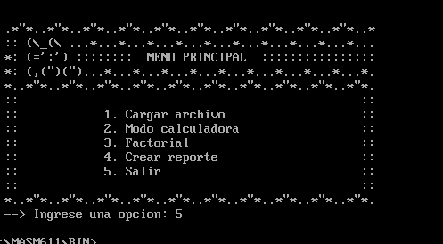

# Manual de Usuario

## Introducción

Este manual está diseñado para  proporcionar todas las herramientas  necesarias para utilizar la calculadora en consola .

En estas páginas, encontrarás información detallada sobre las diferentes opciones disponibles.

## Información

Al ejecutar el programa por primera vez se podrá tener información a detalle, la que se muestra a continuación:
para poder entrar al menu principal se debe precionar enter en caso contrario aparecera un error como el siguiente:

## Menu principal
Este programa cuenta con un total de 5 funciones:
-   **Cargar archivo**: Esta opción permite abrir un archivo que contiene operaciones aritmeticas en un formato prefijo.
-   **Modo Calculadora**: Esta modalidad permite el ingreso de numeros en forma manual.
-   **Factorial**: Permitira calcular el numero factorial de los numeros ingresados.
-   **Crear reporte**: permitira crear un reporte con todas las operaciones que se hayan guardado en el modo calculadora.
- **Salir**: Esta opción cerrara el programa.

En caso de no presionar una opcion que este del menu se generara un error:

## Cargar archivo
Para esta opcion se permitira que el usuario ingrese una ruta en donde se encuentra el archivo a cargar, a manera de que este pueda ser abierto y leido por el programa para poder realizar las operaciones que se encuentren en el archivo.

las operaciones en el archivo deben de estar escritas en formato prefijo, es decir que primero debe de ir el operador y luego los operandos, el archivo debe tener la siguiente estructura:

Primero se colocara el identificador de la operacion, luego el operador y por ultimo los operandos, cada operacion ira separada por comas.

La calculadora se encargara de calcular los valores de las operaciones y los mostrara en consola al finalizar.

## Modo Calculadora

Esta modalidad a diferencia de la anterior, permite que el usuario ingrese los numeros que desee y el operador que desee de forma manual.

para ir agregando los operandos se debe presionar la tecla enter despues de cada numero ingresado, en caso de que se ingrese un operador tambien debe presionar la tecla enter.

al ingresar el segundo numero se podra decidir si se desea realizar una operacion con los dos numeros ingresados o si se desea ingresar otro numero. para esto se debe de ingresar el = para realizar la operacion o cualquier operador para ingresar otro numero.

Nota:Tambien se puede ingresar un numero negativo, para esto se debe de ingresar el signo - antes del numero.

En caso de que se ingrese un operador no valido se generara un error.

Esta calculadora permitira como maximo 10 numeros por operacion, en caso de que se ingrese mas numeros se generara un error.

otra caracteristica de esta calculadora es que al generar el resultado de una operacion, se podra decidir si se desea guardar la operacion y su resultado, para posteriormente generar un reporte con todas las operaciones que se hayan guardado. maximo se podran guardar 10 operaciones. en caso contrario se genera un error.

## Factorial
Esta opcion permite al usuario ingresar un numero entre 00 y 04 y calculara el factorial de dicho numero, proporcionando tanto el procedimiento y su resultado en consola.

En caso de que se ingrese un numero fuera de este rango se generara un error.

## Crear reporte
Esta opcion permite generar un reporte html en donde se mostraran todas las operaciones que se hayan guardado en el modo calculadora, mostrando tanto el identificador, procedimiento y el resultado de cada operacion.

## Salir
Esta opcion dara fin a la ejecucion, cerrara todo y saldra del programa.

