# Manual de Usuario

## Introducción

Este manual está diseñado para  proporcionar todas las herramientas  necesarias para utilizar la calculadora en consola .

En estas páginas, encontrarás información detallada sobre las diferentes opciones disponibles.

## Información

Al ejecutar el programa por primera vez se podrá tener información a detalle, la que se muestra a continuación:
para poder entrar al menu principal se debe precionar enter en caso contrario aparecera un error como el siguiente:

 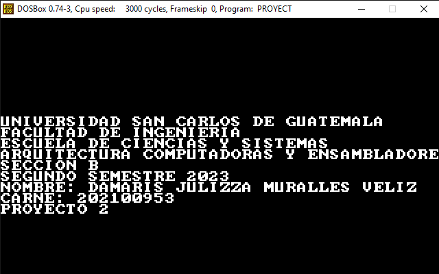

## Menu principal
Este programa cuenta con un total de 5 funciones:
-   **Inicio de sesion**: permite al usuario ingresar al sistema, para esto se debe de ingresar un usuario y una contraseña, en caso de que el usuario no exista o la contraseña sea incorrecta se generara un error.
-   **Registrar usuario**: permite al usuario registrar un nuevo usuario, para esto se debe de ingresar un usuario y una contraseña, en caso de que el usuario ya exista se generara un error.

- **Salir**: Esta opción cerrara el programa.

En caso de no presionar una opcion que este del menu se generara un error:

  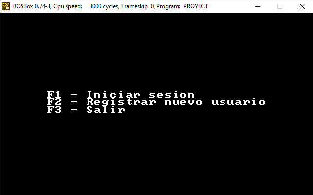
  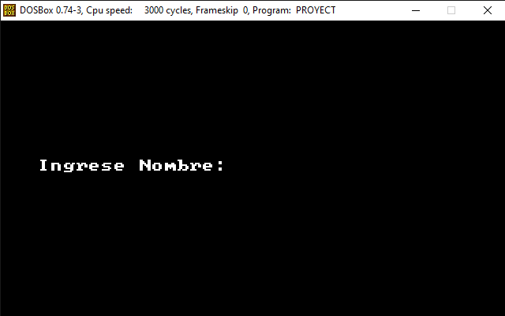 
  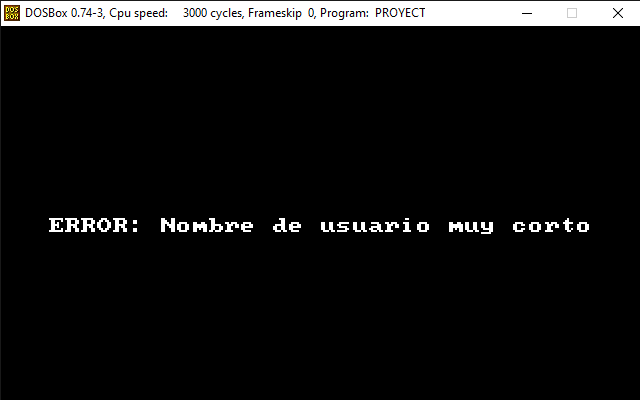
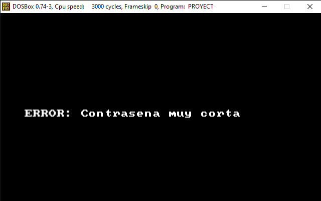 
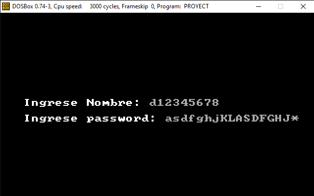
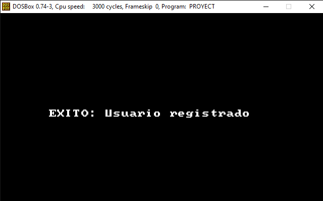 
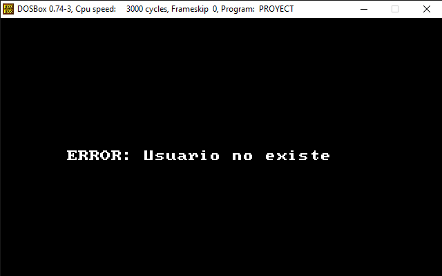 
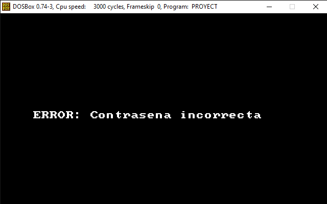

## Usuario bloqueado
Para inicio de sesion se tienen tres intentos, en caso de que se ingresen mal los datos tres veces seguidas se bloqueara el usuario y se generara un error. solo un administrador podra desbloquear el usuario.

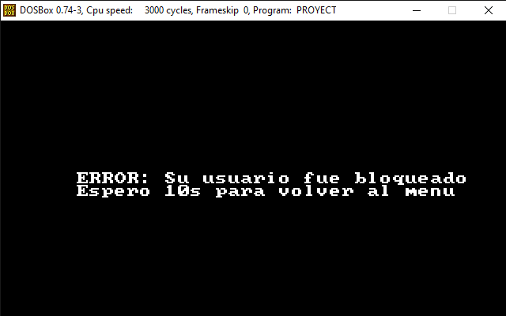 
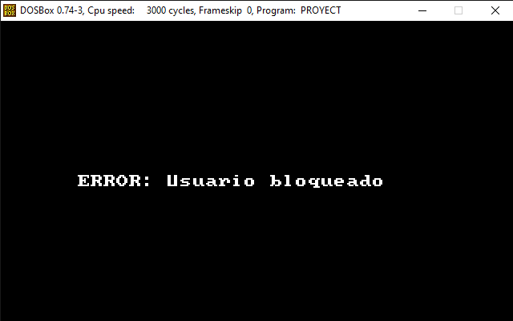

## Usuario Administrador

Los usuarios administradores se dividen en dos tipos, el administrador original y administrador secundario,la diferencia entre estos radica en que el administrador original puede promover o degradar a un usuario o administrador secundario.

Las demas funciones son las mismas para ambos tipos de administradores.
pueden realizar las siguientes funciones:
1. **Ordenar puntajes**: permite ordenar los puntajes de mayor a menor, mostrando el nombre del usuario y su puntaje.
2. **Bloquear usuario**: permite bloquear a un usuario, para esto se debe de ingresar el nombre del usuario que se desea bloquear, en caso de que el usuario no exista se generara un error.
3. **Desbloquear usuario**: permite desbloquear a un usuario, para esto se debe de ingresar el nombre del usuario que se desea desbloquear, en caso de que el usuario no exista se generara un error.
4. **Generar reporte del sistema**: permite generar un reporte en html con todos los usuarios registrados, mostrando su nombre, contraseña, usuarios bloqueados y desbloqueados,ultimas partidas jugadas y puntaje maximo obtenido.
5. **Nueva partida**: permite al administrador jugar una nueva partida, como un usuario normal.
6. **Ver ultimas partidas**: permite al administrador ver las ultimas partidas jugadas, mostrando el nombre del usuario, el puntaje obtenido y el tiempo que tardo en terminar la partida.
7. **cerrar sesion**: permite al administrador cerrar sesion y volver al menu principal.

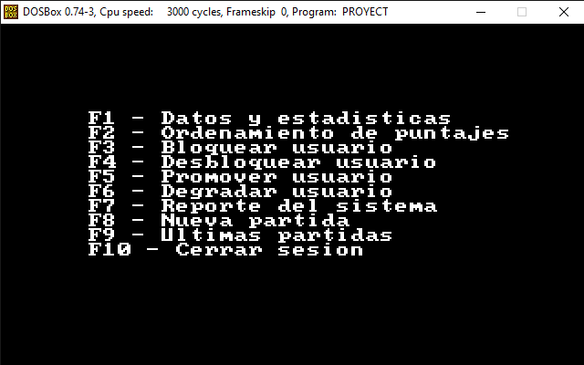 
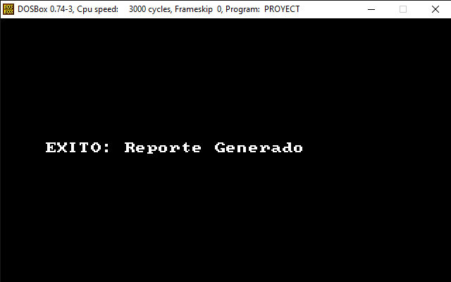
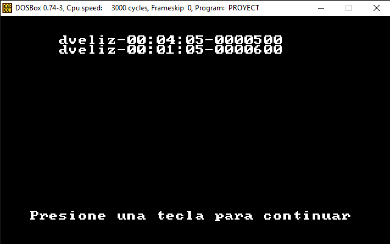 
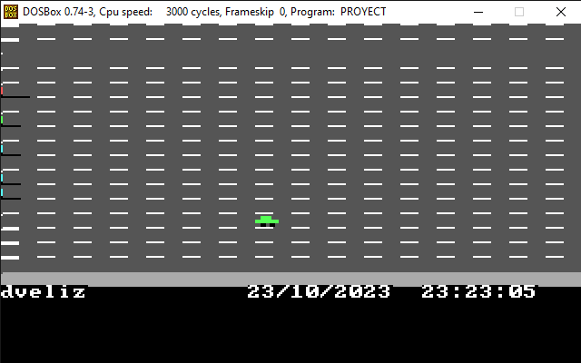
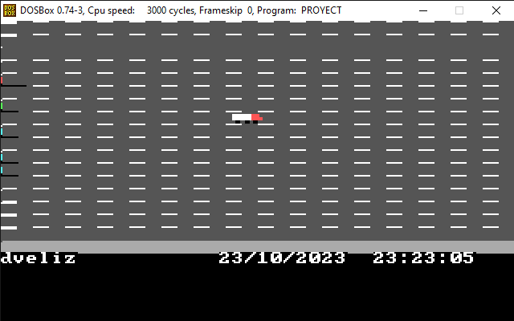 
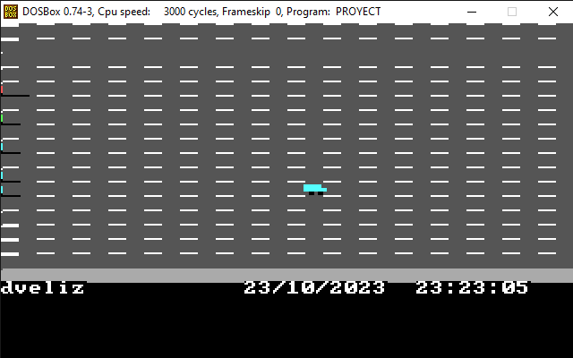
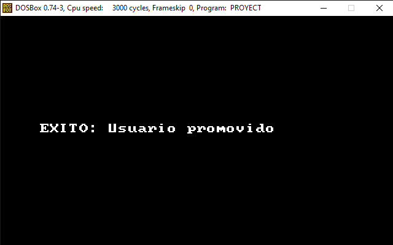
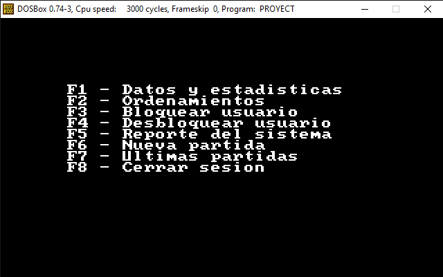 

## Usuario normal
Los usuarios normales pueden realizar las siguientes funciones:
1. **Nueva partida**: permite al usuario jugar una nueva partida, al juegar tendra 3 vidas al terminar estas el juego se terminara y se mostrara el puntaje obtenido. este puntaje se guardara y luego se podra consultar en la opcion ver ultimas partidas. ademas durante el juego se podra pausar el juego y salir del juego.
2. **Ver ultimas partidas**: permite al usuario ver las ultimas partidas jugadas, mostrando el nombre del usuario, el puntaje obtenido y el tiempo que tardo en terminar la partida.
3. **cerrar sesion**:  permite al usuario cerrar sesion y volver al menu principal.

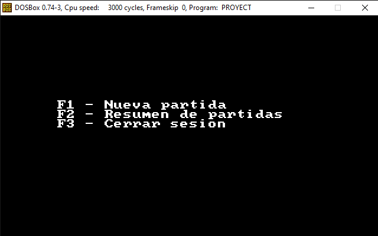 

## Reporte y archivo de datos guardos
El reporte generado por los administradores, los usuarios registrados y las partidas jugadas se guardan en archivos de texto y archivos html y se veran de la siguiente forma.

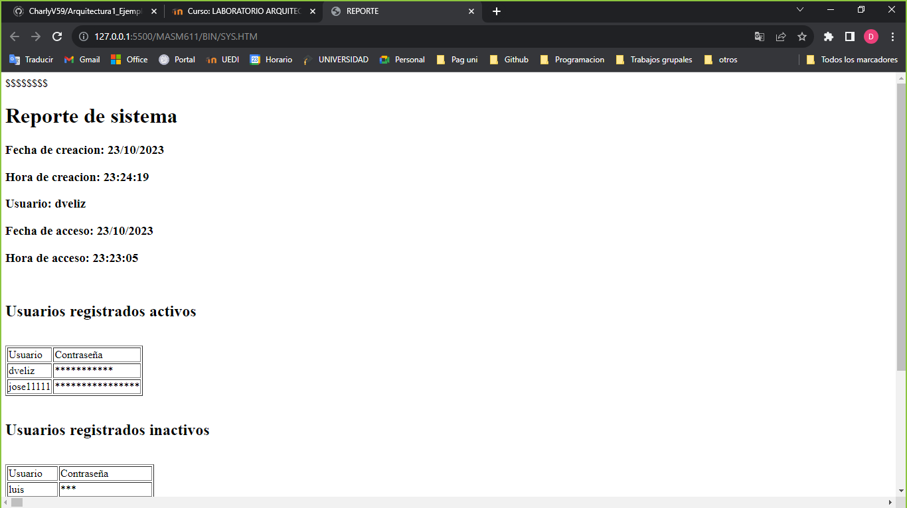
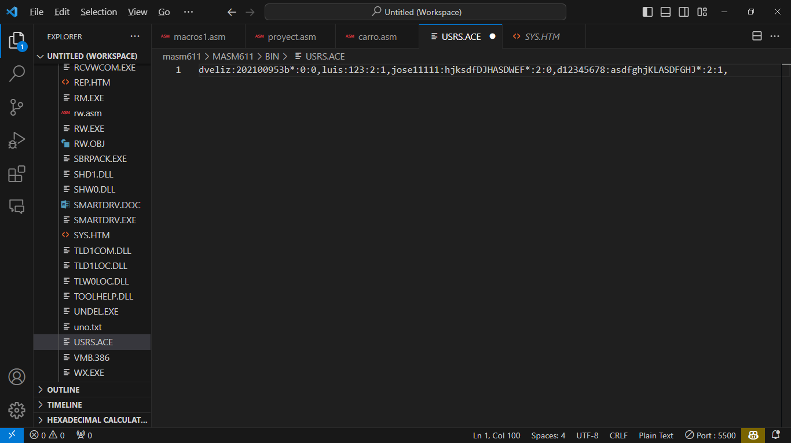 
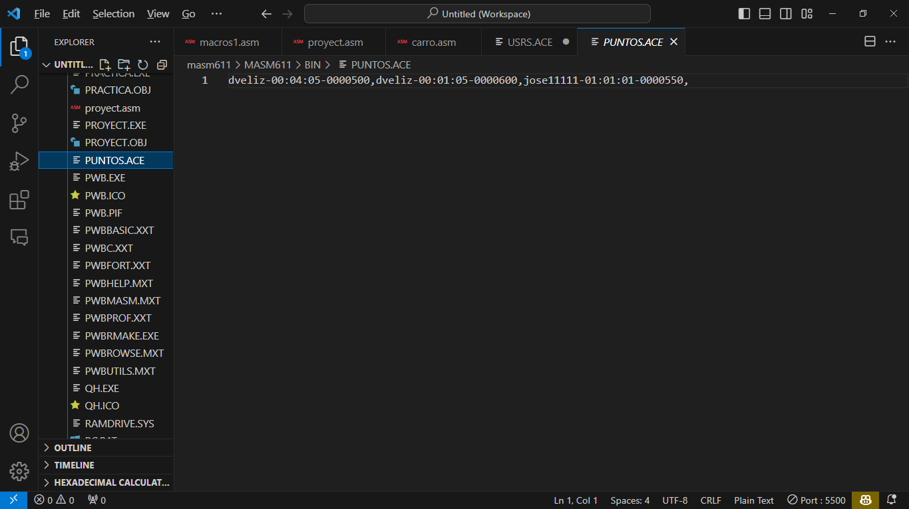

 

